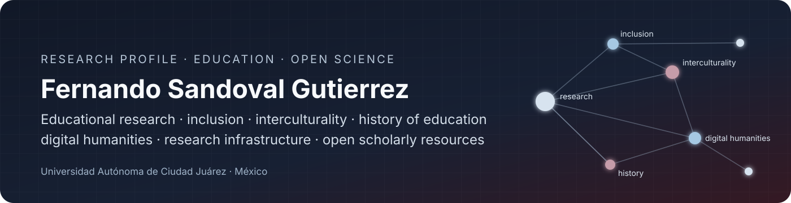
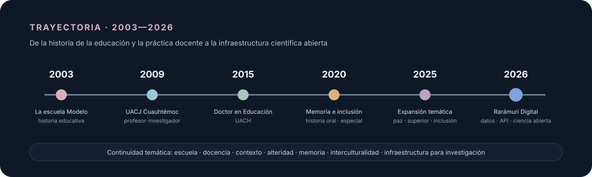

  

  
  
  
  
  

  <strong>Profesor Investigador de Tiempo Completo · Universidad Autónoma de Ciudad Juárez · SNII Nivel I</strong> 
  Educación · práctica docente · inclusión · interculturalidad · historia de la educación · humanidades digitales · ciencia abierta

  <a href="RESEARCH.md"><strong>Arquitectura de investigación</strong></a> ·
  <a href="OUTPUTS.md"><strong>Producción científica</strong></a> ·
  <a href="OPEN-SCIENCE.md"><strong>Ciencia abierta</strong></a> ·
  <a href="https://github.com/fersandovalgtz/raramuri-digital"><strong>Rarámuri Digital</strong></a>

---

## Research hub

Este repositorio funciona como **puerta de entrada a mi trabajo científico**. No pretende sustituir ORCID, un currículum o un repositorio institucional: organiza la trayectoria de investigación, conecta publicaciones con líneas intelectuales y documenta la expansión hacia datos, software de investigación e infraestructura académica reproducible.

<table>
<tr>
<td width="25%" align="center"><strong>43</strong> obras registradas en ORCID corte agosto 2026</td>
<td width="25%" align="center"><strong>2009—</strong> Profesor Investigador de Tiempo Completo · UACJ</td>
<td width="25%" align="center"><strong>2,581</strong> entradas lexicográficas Rarámuri Digital</td>
<td width="25%" align="center"><strong>30</strong> productos derivados de datos e infraestructura</td>
</tr>
</table>

### Cuatro puertas de entrada

<table>
<tr>
<td width="50%" valign="top">

#### 🔬 [Arquitectura de investigación](RESEARCH.md)

Cómo se relacionan práctica docente, inclusión, interculturalidad, formación del profesorado, historia educativa, educación superior y humanidades digitales.

</td>
<td width="50%" valign="top">

#### 📚 [Producción científica](OUTPUTS.md)

Selección razonada de artículos, libros, capítulos, materiales educativos y datos, organizada por periodos y líneas de trabajo.

</td>
</tr>
<tr>
<td width="50%" valign="top">

#### ♻️ [Ciencia abierta](OPEN-SCIENCE.md)

Criterios de trazabilidad, versionado, interoperabilidad, preservación, citación, gobernanza y reutilización de productos científicos digitales.

</td>
<td width="50%" valign="top">

#### 🧭 [Rarámuri Digital](https://github.com/fersandovalgtz/raramuri-digital)

Infraestructura lexicográfica rarámuri–español: dataset, API, TEI Lex-0, documentación científica, DOI, control de calidad y preservación.

</td>
</tr>
</table>

## Ecosistema de investigación

  

La **práctica docente** es el núcleo que mantiene continuidad en la trayectoria. Desde ahí se conectan problemas de inclusión y educación especial, interculturalidad y contextos indígenas, historia y memoria escolar, formación del profesorado, educación superior y, desde 2026, una agenda explícita de humanidades digitales e infraestructura científica.

[Explorar la arquitectura completa →](RESEARCH.md)

## Infraestructura científica destacada

### Rarámuri Digital

  
  
  
  
  

**Infraestructura lexicográfica rarámuri–español para investigación, docencia, humanidades digitales y desarrollo de aplicaciones.** Publica un conjunto de datos reproducible con 2,581 entradas, 30 productos derivados, identificadores persistentes, trazabilidad documental, exportaciones interoperables, API pública y documentación científica.

| Capa | Implementación |
|---|---|
| **Datos** | CSV · JSON · XML · SQL · TEI Lex-0 |
| **Servicios** | API pública · OpenAPI 3.1 |
| **Citación** | DOI · ORCID · Citation File Format |
| **Metadatos** | CodeMeta · manifiestos legibles por máquina |
| **Integridad** | SHA-256 · validaciones automáticas · informe de calidad |
| **Preservación** | Zenodo · Software Heritage · Git |
| **Gobernanza** | derechos lingüísticos · procedencia · validación comunitaria pendiente |

> La publicación del recurso está autorizada para difusión; la validación lingüística comunitaria permanece pendiente. La disponibilidad técnica no sustituye la autoridad lingüística de las comunidades hablantes.

[Consultar Rarámuri Digital →](https://raramuri.ceees.mx) · [Revisar su arquitectura científica →](OPEN-SCIENCE.md)

## Producción reciente seleccionada

**2025 — La práctica docente en el aula de cristal.** *Revista de Estudios y Experiencias en Educación*. [DOI 10.21703/rexe.v24i55.3129](https://doi.org/10.21703/rexe.v24i55.3129)

**2025 — Estrategias pedagógicas para la prevención de la violencia: el rol de la práctica docente en la creación de culturas de paz.** *RECIE*. [DOI 10.33010/recie.v9i0.2430](https://doi.org/10.33010/recie.v9i0.2430)

**2025 — Prácticas educativas emergentes: la docencia en el nivel superior como herramienta de vinculación y responsabilidad social.** *QVADRATA*. [DOI 10.54167/qvadrata.v7i13.1831](https://doi.org/10.54167/qvadrata.v7i13.1831)

**2025 — Pensar la universidad desde el aula: aportes y desafíos del Modelo Educativo Visión 2040 en la Universidad Autónoma de Ciudad Juárez.** *DOCERE*. [DOI 10.33064/2025docere338683](https://doi.org/10.33064/2025docere338683)

[Ver panorama de producción →](OUTPUTS.md)

## Trayectoria

  

La continuidad no está en un único tema, sino en una forma de mirar la educación: recuperar la experiencia situada de escuelas, docentes, instituciones y comunidades; relacionarla con su contexto; y producir evidencia que pueda circular en forma de libros, artículos, testimonios, materiales educativos, datos e infraestructura digital.

## Identidad académica

El registro público de ORCID consigna la incorporación a la **Universidad Autónoma de Ciudad Juárez en 2009** como Profesor Investigador de Tiempo Completo y el Doctorado en Educación por la Universidad Autónoma de Chihuahua entre 2010 y 2015. Publicaciones recientes lo identifican como **integrante del Sistema Nacional de Investigadoras e Investigadores, Nivel I**. La UACJ documentó además su participación como fundador del campus Cuauhtémoc y su nombramiento como jefe de la División Multidisciplinaria en 2023.

**Perfiles e identificadores:** [ORCID](https://orcid.org/0000-0002-3168-6725) · [Google Scholar](https://scholar.google.com/citations?user=zNZsYYAAAAAJ&hl=es) · [CATHI-UACJ](https://cathi.uacj.mx/handle/20.500.11961/3028/browse?authority=0000-0002-3168-6725&type=author) · [ResearchGate](https://www.researchgate.net/profile/Fernando-Sandoval-Gutierrez) · [Academia.edu](https://uacj.academia.edu/FernandoSandoval) · [ResearchID](https://researchid.co/fersandovalg)

## Colaboración académica

Interesado en colaboración en **investigación educativa, práctica docente, inclusión, interculturalidad, historia de la educación, humanidades digitales, documentación lingüística, datos abiertos y software de investigación**.

**Contacto institucional:** [fernando.sandoval@uacj.mx](mailto:fernando.sandoval@uacj.mx)

---

  Research profile · Universidad Autónoma de Ciudad Juárez · México

