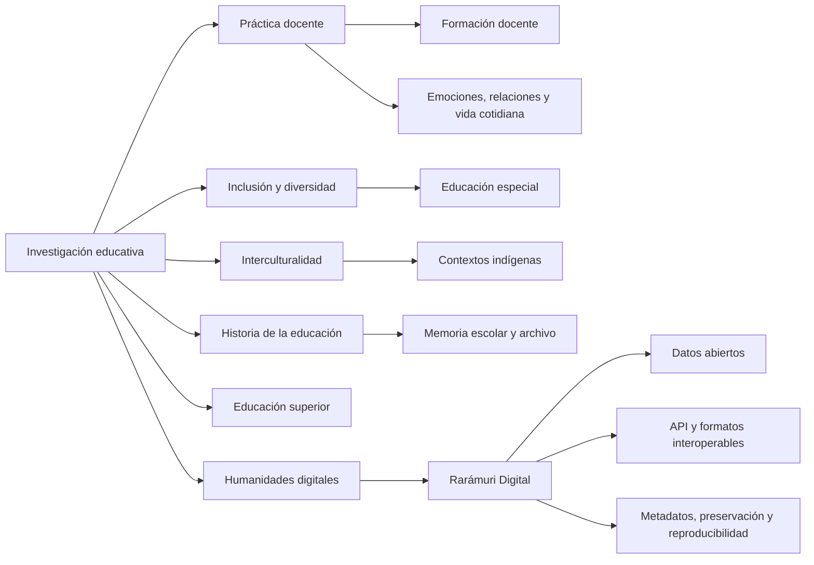

  

  
  
  
  
  

  <strong>Profesor-investigador de tiempo completo · Universidad Autónoma de Ciudad Juárez · Integrante del SNII</strong> 
  Investigación educativa · práctica docente · inclusión · interculturalidad · historia de la educación · humanidades digitales · ciencia abierta

---

## Perfil de investigación

Soy investigador en educación en la **Universidad Autónoma de Ciudad Juárez (UACJ)**. Mi trabajo estudia la práctica docente como fenómeno histórico, institucional, relacional y cultural, con especial atención a la **formación del profesorado, inclusión educativa, interculturalidad, educación especial, memoria escolar y educación superior**.

En años recientes he ampliado esta agenda hacia las **humanidades digitales y la infraestructura científica abierta**: conjuntos de datos reproducibles, recursos lingüísticos, metadatos citables, APIs, documentación técnica y mecanismos de preservación y trazabilidad. Me interesa que los productos de investigación puedan ser leídos, reutilizados, auditados y preservados más allá del artículo académico convencional.

<strong>English research statement</strong>

 
I am an educational researcher at Universidad Autónoma de Ciudad Juárez (UACJ), Mexico. My work examines teaching practice through historical, institutional, relational, and cultural perspectives, with particular attention to teacher education, inclusion, interculturality, special education, school memory, and higher education. My recent work extends this agenda into digital humanities and open research infrastructure, including reproducible datasets, linguistic resources, persistent scholarly metadata, APIs, and preservation-oriented research software.

## Huella académica

| Dimensión | Evidencia pública seleccionada |
|---|---|
| **Trayectoria universitaria** | Profesor Investigador de Tiempo Completo en la UACJ desde 2009 |
| **Producción registrada** | 43 obras visibles en ORCID al corte de agosto de 2026 |
| **Investigación publicada** | Artículos, libros, capítulos, ponencias, materiales educativos y conjuntos de datos |
| **Infraestructura abierta** | Rarámuri Digital: 2,581 entradas lexicográficas y 30 productos derivados |
| **Identificadores persistentes** | ORCID · DOI · Software Heritage · Citation File Format |
| **Interoperabilidad** | CSV · JSON · XML · SQL · TEI Lex-0 · OpenAPI 3.1 · CodeMeta |

## Mapa de investigación

## Infraestructura científica destacada

### Rarámuri Digital

**Infraestructura lexicográfica rarámuri–español para investigación, docencia, humanidades digitales y desarrollo de aplicaciones.**

| Datos | Plataforma | Entradas | Productos | Preservación / cita |
|---|---|---:|---:|---|
| 1.0.0 | 3.1.0 | **2,581** | **30** | Zenodo DOI + Software Heritage |

El proyecto combina un conjunto de datos lexicográficos reproducible con identificadores persistentes, trazabilidad documental, control de calidad, documentación científica y exportaciones interoperables. Incluye API pública, especificación OpenAPI 3.1, TEI Lex-0, CFF, CodeMeta, manifiestos de integridad SHA-256 y una política explícita de gobernanza y derechos lingüísticos.

> **Estado editorial:** la publicación del recurso está autorizada para difusión; la validación lingüística comunitaria permanece pendiente. La disponibilidad técnica del corpus no sustituye la autoridad lingüística de las comunidades hablantes.

**Accesos:** [consulta pública](https://raramuri.ceees.mx) · [repositorio](https://github.com/fersandovalgtz/raramuri-digital) · [datos y DOI](https://doi.org/10.5281/zenodo.21483353) · [OpenAPI](https://raramuri.ceees.mx/api/openapi)

## Producción científica seleccionada

| Año | Línea | Producto |
|---:|---|---|
| **2026** | Humanidades digitales / recursos lingüísticos | **Rarámuri Digital: conjunto de datos lexicográficos rarámuri–español.** Dataset citable. [DOI](https://doi.org/10.5281/zenodo.21483353) |
| **2025** | Práctica docente | **La práctica docente en el aula de cristal. Redefiniendo la enseñanza hacia el segundo cuarto del siglo XXI.** *Revista de Estudios y Experiencias en Educación*. [DOI](https://doi.org/10.21703/rexe.v24i55.3129) |
| **2025** | Cultura de paz / práctica docente | **Estrategias pedagógicas para la prevención de la violencia: el rol de la práctica docente en la creación de culturas de paz.** *RECIE*. [DOI](https://doi.org/10.33010/recie.v9i0.2430) |
| **2025** | Educación superior | **Prácticas educativas emergentes: la docencia en el nivel superior como herramienta de vinculación y responsabilidad social.** *QVADRATA*. [DOI](https://doi.org/10.54167/qvadrata.v7i13.1831) |
| **2020** | Historia oral / educación especial | **La práctica desmembrada. Una experiencia de historias compartidas en el nivel de Educación Especial en Chihuahua.** *Anuario Mexicano de Historia de la Educación*. [DOI](https://doi.org/10.29351/amhe.v2i1.333) |
| **2020** | Historia y política educativa | **Espacios escolares abandonados, práctica docente y política educativa en Chihuahua.** *Chihuahua Hoy*. [DOI](https://doi.org/10.20983/chihuahuahoy.2020.18.7) |
| **2016** | Historia de la educación | **Miradas olvidadas: la docencia en Chihuahua en los inicios del siglo XX.** *Chihuahua Hoy*. [DOI](https://doi.org/10.20983/chihuahuahoy.2016.14.10) |
| **2015** | Memoria docente | **Miradas olvidadas: la vida cotidiana de docentes de principios del siglo XX.** *IE Revista de Investigación Educativa de la REDIECH*. [DOI](https://doi.org/10.33010/ie_rie_rediech.v6i10.170) |

> La producción completa y actualizada puede consultarse en [ORCID](https://orcid.org/0000-0002-3168-6725), [Google Scholar](https://scholar.google.com/citations?user=zNZsYYAAAAAJ&hl=es), [CATHI-UACJ](https://cathi.uacj.mx/handle/20.500.11961/3028/browse?authority=0000-0002-3168-6725&type=author) y [ResearchGate](https://www.researchgate.net/profile/Fernando-Sandoval-Gutierrez).

## Ciencia abierta, estándares y reproducibilidad

Mi interés en GitHub no es presentar programación como un fin en sí mismo. Lo utilizo como **infraestructura de investigación** para documentar procesos, preservar versiones, publicar datos, hacer explícita la procedencia de los productos y facilitar su revisión y reutilización.

  
  
  
  
  
  
  

**Prácticas incorporadas en proyectos abiertos:** versionado; documentación científica; diccionarios de datos; informes de calidad; archivos de citación; metadatos legibles por máquina; APIs documentadas; formatos interoperables; licencias diferenciadas para código y datos; trazabilidad de fuentes; preservación y gobernanza explícita.

## Trayectoria: investigación, docencia y memoria

| Periodo | Hito seleccionado |
|---|---|
| **2003** | Publicación de *La escuela Modelo*, antecedente temprano de la línea de historia de la educación |
| **2009–actualidad** | Profesor Investigador de Tiempo Completo en la Universidad Autónoma de Ciudad Juárez |
| **2010–2015** | Doctorado en Educación, Universidad Autónoma de Chihuahua |
| **2015–2020** | Consolidación de líneas sobre práctica docente, historia educativa, educación especial y vida cotidiana escolar |
| **2021–2025** | Expansión hacia interculturalidad, educación superior, género, responsabilidad social e innovación pedagógica |
| **2026–** | Humanidades digitales, recursos lingüísticos abiertos e infraestructura científica reproducible |

## Qué desarrollo como investigador

<table>
<tr>
<td width="50%" valign="top">

### Investigación y publicación

Artículos científicos, libros, capítulos, historia oral, análisis institucional, investigación sobre práctica docente, educación especial, inclusión, interculturalidad y educación superior.

</td>
<td width="50%" valign="top">

### Datos e infraestructura

Datasets, APIs, documentación científica, esquemas de datos, metadatos, recursos educativos abiertos, preservación digital y productos de humanidades digitales.

</td>
</tr>
<tr>
<td width="50%" valign="top">

### Docencia y formación

Formación de docentes e investigadores, diseño didáctico, evaluación educativa, educación inclusiva y acompañamiento de proyectos académicos.

</td>
<td width="50%" valign="top">

### Historia, archivo y memoria

Historia de instituciones educativas, memoria escolar, documentación de prácticas docentes y recuperación de patrimonio educativo regional.

</td>
</tr>
</table>

## Perfiles e identificadores académicos

[ORCID](https://orcid.org/0000-0002-3168-6725) · [Google Scholar](https://scholar.google.com/citations?user=zNZsYYAAAAAJ&hl=es) · [CATHI-UACJ](https://cathi.uacj.mx/handle/20.500.11961/3028/browse?authority=0000-0002-3168-6725&type=author) · [ResearchGate](https://www.researchgate.net/profile/Fernando-Sandoval-Gutierrez) · [Academia.edu](https://uacj.academia.edu/FernandoSandoval) · [ResearchID](https://researchid.co/fersandovalg)

## Colaboración

Me interesan colaboraciones académicas y técnicas en **investigación educativa, práctica docente, inclusión, interculturalidad, historia de la educación, humanidades digitales, documentación lingüística, datos abiertos y software de investigación**.

**Contacto institucional:** [fernando.sandoval@uacj.mx](mailto:fernando.sandoval@uacj.mx)

---

  Perfil orientado a investigación, ciencia abierta e infraestructura académica reproducible.

