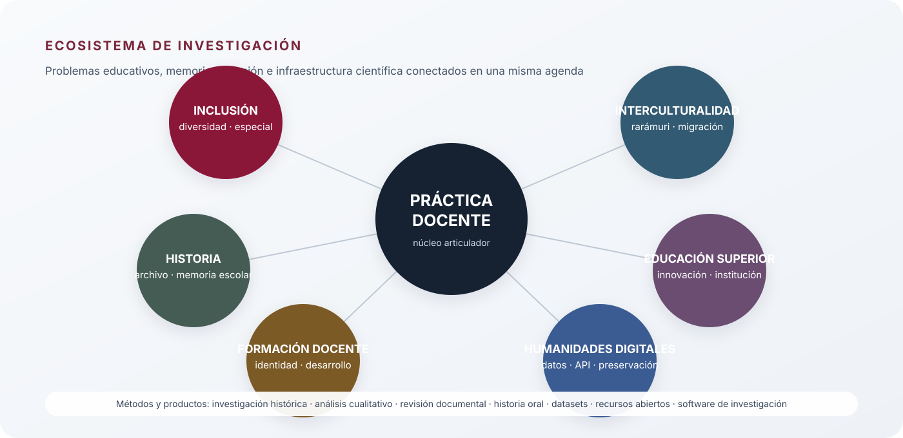

# Arquitectura de investigación

[← Volver al perfil](README.md) · [Producción seleccionada](OUTPUTS.md) · [Ciencia abierta](OPEN-SCIENCE.md)

La investigación de Fernando Sandoval Gutierrez se organiza alrededor de un problema persistente: **cómo se construye, experimenta y transforma la práctica educativa en contextos históricos, institucionales y culturalmente diversos**. Las líneas no operan como compartimentos independientes. La práctica docente funciona como núcleo articulador y conecta historia de la educación, inclusión, interculturalidad, formación del profesorado, educación superior y, más recientemente, humanidades digitales e infraestructura científica abierta.

  

## Práctica docente como núcleo analítico

La práctica docente aparece de manera sostenida en la producción académica como objeto de investigación, espacio de interacción social y dispositivo capaz de reproducir o transformar condiciones educativas. Esta línea examina la vida cotidiana del aula, la identidad profesional, las relaciones humanas, las emociones, la responsabilidad social y los procesos de cambio pedagógico.

Productos representativos incluyen *La práctica docente en el aula de cristal. Redefiniendo la enseñanza hacia el segundo cuarto del siglo XXI* (2025), *Estrategias pedagógicas para la prevención de la violencia: el rol de la práctica docente en la creación de culturas de paz* (2025) y trabajos previos sobre emociones, identidad y formación docente.

## Inclusión, educación especial y alteridad

Esta línea aborda las condiciones bajo las cuales la escuela reconoce —o deja de reconocer— diferencias, necesidades y trayectorias diversas. Se articula con la experiencia en educación especial y con una preocupación más amplia por la alteridad, la justicia educativa y los procesos de exclusión.

Entre sus expresiones se encuentran trabajos sobre educación especial, historias compartidas, discapacidad, migración, violencia e inclusión educativa. El enfoque desplaza la inclusión desde el plano exclusivamente normativo hacia las decisiones concretas que se producen en la práctica docente y en la vida institucional.

## Interculturalidad y contextos indígenas

La investigación sobre interculturalidad se relaciona con la región de Cuauhtémoc y el noroeste de Chihuahua, particularmente con comunidades y población rarámuri. Incluye problemas de escuela pública, diversidad cultural, recursos educativos y documentación lingüística.

El libro *Rarámuri. Nivel inicial. Cuaderno para el maestro* (UACJ, 2021) constituye un antecedente directo de esta línea. En 2026, **Rarámuri Digital** amplía el trabajo hacia una infraestructura lexicográfica reproducible con datos estructurados, formatos interoperables, API pública, metadatos citables y mecanismos de preservación.

## Historia de la educación, archivo y memoria escolar

La trayectoria comienza públicamente, al menos desde 2003, con *La escuela Modelo*. Posteriormente se desarrollan trabajos sobre la historia de la docencia en Chihuahua, la vida cotidiana de profesores de principios del siglo XX, la alternancia política y educativa, el cierre de escuelas rurales y la historia institucional de la UACJ en Cuauhtémoc.

La línea se caracteriza por utilizar documentos históricos, expedientes, fuentes institucionales, testimonios y memoria escolar para reconstruir la experiencia educativa más allá de las normas y discursos oficiales.

## Educación superior, institución e innovación

Esta línea estudia la universidad como espacio de práctica, organización y transformación educativa. Incluye responsabilidad social, innovación pedagógica, modelos educativos, enseñanza en el nivel superior y desarrollo institucional.

La experiencia académica en la UACJ desde 2009 y la participación en la fundación y posterior conducción del campus Cuauhtémoc proporcionan un contexto institucional que dialoga con esta agenda. La UACJ documentó públicamente el nombramiento de Fernando Sandoval como jefe de la División Multidisciplinaria en Cuauhtémoc en 2023 y lo identifica como fundador del campus.

## Humanidades digitales e infraestructura científica

La expansión más reciente busca que los productos científicos no terminen en un documento cerrado. El objetivo técnico es producir objetos que puedan **consultarse, citarse, verificarse, versionarse, transformarse y preservarse**.

Rarámuri Digital constituye actualmente el principal laboratorio de esta línea. Integra datos lexicográficos, exportaciones CSV/JSON/XML/SQL/TEI Lex-0, OpenAPI 3.1, CodeMeta, Citation File Format, manifiestos de integridad, documentación de calidad, gobernanza, DOI y preservación en Software Heritage.

## Continuidad metodológica

La producción combina enfoques históricos y documentales con investigación cualitativa, análisis de prácticas, historia oral, revisión de literatura y, en proyectos recientes, modelado de datos y construcción de infraestructura digital reproducible. La diversidad metodológica responde a una constante: seleccionar el dispositivo de investigación de acuerdo con la naturaleza del problema y conservar una relación explícita entre fuente, interpretación y producto.

## Contexto institucional

**Universidad Autónoma de Ciudad Juárez**  
Profesor Investigador de Tiempo Completo desde 2009, según el registro público de ORCID. La página institucional del Campus Cuauhtémoc identifica actualmente a Fernando Sandoval Gutiérrez como coordinador de la Licenciatura en Derecho.

**Identificador persistente**  
ORCID: [0000-0002-3168-6725](https://orcid.org/0000-0002-3168-6725)

---

Esta página describe la arquitectura intelectual del trabajo; no sustituye el currículum ni pretende ser un inventario exhaustivo de publicaciones.